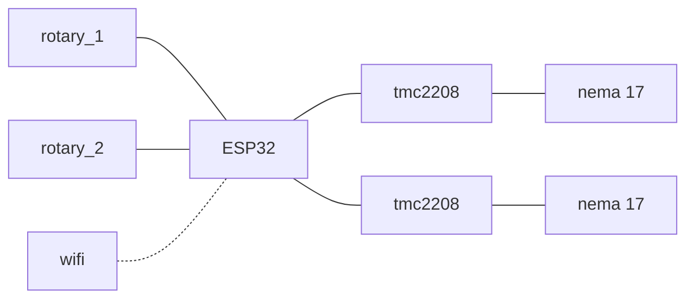

# rotor

## hardware schematics

```mermaid
flowchart LR
rotary_1 --- ESP32
rotary_2 --- ESP32
ESP32 --- tmc1["tmc2208"] --- nema1["nema 17"]
ESP32 --- tmc2["tmc2208"] --- nema2["nema 17"]
wifi -.- ESP32
```

## hardware wiring

| ESP32 | TMC2208 |
| --- | --- |
|26|EN (1)|
|25|STEP (1)|
|33|DIR (1)|
|16|EN (2)|
|17|STEP (2)|
|5|DIR (2)|