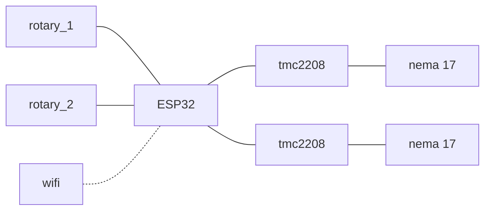

# rotor

## hardware schematics

```mermaid
flowchart LR
rotary_1 --- ESP32
rotary_2 --- ESP32
ESP32 --- tmc1["tmc2208"] --- nema1["nema 17"]
ESP32 --- tmc2["tmc2208"] --- nema2["nema 17"]
wifi -.- ESP32
```